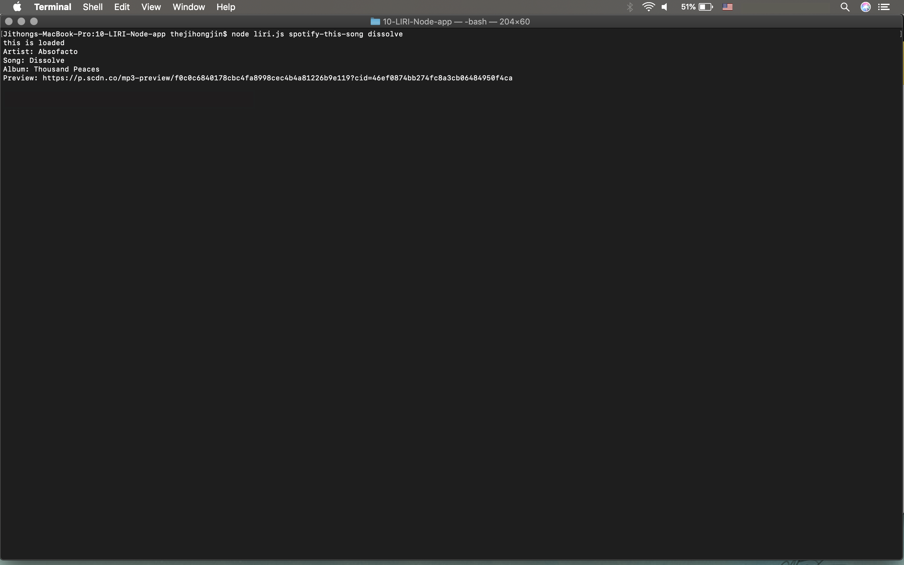
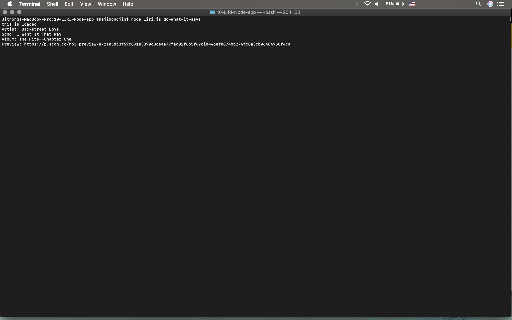

# 10-LIRI-Node-app
https://github.com/thejihongjin/10-LIRI-Node-app

# LIRI Bot
### Overview
LIRI is like iPhone's SIRI. However, while SIRI is a Speech Interpretation and Recognition Interface, LIRI is a _Language_ Interpretation and Recognition Interface. LIRI is be a command line node app that takes in parameters and gives you back data. LIRI searches Spotify for songs, Bands in Town for concerts, and OMDB for movies. (Note: as this is a CLI App, it cannot be deployed to GitHub pages or Heroku. If you would like to run it, you need to clone the app from Github and supply your own `.env` file for it to work.)

LIRI takes in one of the following commands:
### What Each Command Should Do
1. `node liri.js concert-this <artist/band name here>`
   * This searches the Bands in Town Artist Events API for an artist and prints the following information in the terminal:
     ```
       * Name of the venue
       * Venue location
       * Date of the event (formatted as "MM/DD/YYYY" using moment)
     ```


2. `node liri.js spotify-this-song '<song name here>'`
   * This searches the Spotify API and prints the following information in the terminal:
     ```
       * Artist(s)
       * The song's name
       * The album that the song is from
       * A preview link of the song from Spotify
     ```


   * If no song is provided with this command, the song defaults to "The Sign" by Ace of Base


3. `node liri.js movie-this '<movie name here>'`
   * This searches the OMDB API and prints the following information in the terminal:
     ```
       * Title of the movie
       * Year the movie came out
       * IMDB Rating of the movie
       * Rotten Tomatoes Rating of the movie
       * Country where the movie was produced
       * Language of the movie
       * Plot of the movie
       * Actors in the movie
     ```


   * If no movie is provided with this command, the movie defaults to 'Mr. Nobody'


4. `node liri.js do-what-it-says`
   * This uses the `fs` Node package to take the text inside of random.txt and use it to call one of LIRI's commands.
     * It runs `spotify-this-song` for "I Want it That Way," as follows the text in `random.txt`.
     * You can edit the text in random.txt to test out the feature for movie-this and concert-this.


* In addition to printing the data to the terminal, each command also logs (i.e., appends) the data to a .txt file called `log.txt`.
